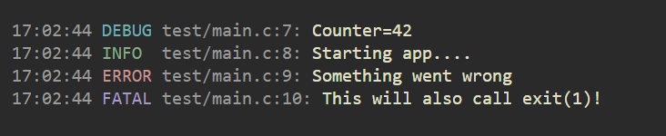

# stx
A custom standard lib in C23, a single header file.

## Package management / portable development
Nix, specifically nix-shell (https://nixos.org/download/)

## Arena

## UTF-8 String

## Dynamic array

## Logging


[log.h](stx/log.h?raw=1) is very simple, the API looks as such:

```c
#define LOG_DEBUG
#define LOG_WITH_TIME
#include "log.h"

int main() {
  log_debug("Counter=%d", 42);
  log_info("%s", "Starting app....");
  log_error("%s", "Something went wrong");
  log_fatal("%s", "This will also call exit(1)!");
  return 0;
}
```

If ```LOG_DEBUG``` is defined before the ```log.h``` import ```log_debug()``` will printf, otherwise the macro doesn't expand.

If ```LOG_WITH_TIME``` is defined before the ```log.h``` import all logging functions will also output the time.


## TODOS
Logging should allow to save to file(s).